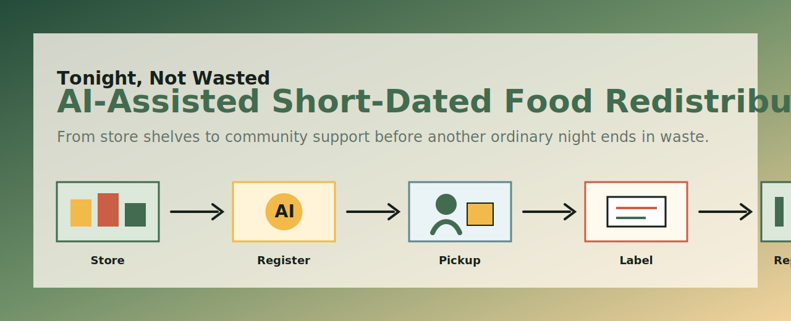

# Tonight, Not Wasted

## AI-Assisted Short-Dated Food Redistribution Platform

**One-sentence pitch:** Tonight, Not Wasted uses AI-assisted registration, labeling, volunteer coordination, and transparent reporting to help still-edible short-dated food travel one step further before it is wasted.

[Read the webpage draft](./index.html) · [Read the full pitch text](./docs/crowdfunding-pitch-draft.md) · [View visual assets](./assets/)

---

## Project Overview

Every evening, campus supermarkets, convenience stores, bakeries, and small cafes may have food that is still safe to eat but difficult to sell because the store is closing, the date is not new enough, or demand has changed. At the same time, late-returning students, low-budget students, security guards, dormitory staff, cleaners, and night-shift workers may need affordable and dignified food support.

**Tonight, Not Wasted** is not a student-run food bank. It is a lightweight collaboration toolkit that helps stores, partner organizations, and volunteers register eligible short-dated food, generate labels, coordinate pickup, and publish transparent reports.

---

## Crowdfunding Goal

We are crowdfunding a **30-day campus or community pilot**.

The funds will support:

| Use of funds | Purpose |
| --- | --- |
| Label printer and label paper | Mark source, pickup time, storage notes, and suggested consumption time |
| Insulated boxes and sorting crates | Support short-distance pickup and distribution |
| Basic safety supplies | Gloves, sealing bags, alcohol wipes, and thermometers |
| Forms and reporting templates | Standardize intake records and public reports |
| Volunteer training materials | Reduce confusion and improve accountability |
| Store onboarding materials | Help 3-5 stores join the pilot more easily |
| Public updates | Make results, rejected items, and fund use visible |

---

## The Eight Rhetorical Moves

### Move 1: Gaining Attention

Food waste can begin at closing time, quietly and routinely. Some food is not expired, its package is complete, and its source is clear. Yet because it looks less fresh than tomorrow's stock or because demand changed, it may move toward discount shelves, write-off records, or disposal.

### Move 2: Introducing the Offer

Tonight, Not Wasted provides a lightweight AI-assisted workflow:

- Food information registration
- Rule-based intake prompts
- Volunteer route suggestions
- Clear label drafting
- Daily or weekly transparent reports

The pilot focuses on lower-risk items such as sealed packaged food, bread, biscuits, cereal, bottled drinks, instant food, uncut fruit, and traceable dairy products that are still within shelf life.

### Move 3: Establishing Credentials

As a student team, our credibility comes from a limited and responsible scope. We are not claiming to replace professional food banks, logistics systems, or regulatory institutions. We are testing a careful 30-day pilot with 3-5 partner stores, one distribution point, trained volunteers, and public records.

### Move 4: Soliciting Support

| Tier | Reward / Meaning |
| --- | --- |
| ¥19 | Support one batch of labels |
| ¥49 | Support one volunteer pickup |
| ¥99 | Support one safety supply pack |
| ¥299 | Help one store join the pilot |
| ¥999 | Build one redistribution toolkit corner |
| ¥4999 | Support the full 30-day pilot |

Backing this project helps test whether a clearer, safer, and more transparent workflow can make local food redistribution more practical.

### Move 5: Expressing Gratitude

Every contribution helps replace vague goodwill with a clearer process: better records, safer labels, trained volunteers, and public reports. Whether someone supports one label, one pickup, one store, or the whole pilot, they help still-edible food receive one more chance to be seen, recorded, and shared with dignity.

### Move 6: Encouraging Further Communication

This pilot depends on cooperation:

- Stores can join as pilot partners.
- Volunteers can help with pickup, labeling, sorting, and recording.
- Supporters can follow public updates and give feedback.

At the end of the pilot, we will publish a review explaining what worked, what did not work, and what should change before any future expansion.

### Move 7: Describing Transactional Details

| Stage | Plan |
| --- | --- |
| Week 1: Preparation | Contact stores, confirm one distribution point, design intake rules, prepare forms, create label templates, and train volunteers |
| Weeks 2-3: Operation | Register eligible food, use AI for organization and label drafting, review items, complete pickup, distribute, and record results |
| Week 4: Review | Summarize partner participation, food categories, accepted and rejected items, volunteer activities, fund use, and operational problems |

We will not promise a fixed amount of redistributed food, because supply is uncertain. Instead, we promise to make the process clear, cautious, and publicly reviewable.

### Move 8: Addressing Risks and Challenges

| Risk | Response |
| --- | --- |
| Food safety risk | No expired food, opened food, damaged packages, unknown-source food, or unclear-storage items |
| Unstable store participation | Start with only 3-5 stores and keep intake simple |
| Unstable food supply | Use same-day confirmation instead of claiming precise prediction |
| AI limitations | AI assists with organization, labels, routes, and reports; humans make final decisions |
| Limited student capacity | Position the project as a pilot toolkit working with schools, communities, stores, or charity organizations |

---

## Current Materials

- `index.html`: scrollable crowdfunding webpage draft
- `styles.css`: webpage styling
- `script.js`: light interaction for navigation and reveal effects
- `docs/crowdfunding-pitch-draft.md`: full English text draft
- `assets/readme-banner.svg`: temporary README campaign visual

---

## To Be Added Later

- AI-generated or AI-assisted images
- Short video material
- AI prompt records and conversation links
- Group division of labor
- Individual and group reflections
- Final public deployment link through GitHub Pages

---

## AI Collaboration Statement

This section will be completed later. It should explain which parts were AI-generated, which parts were AI-assisted and manually revised, and which parts were written or edited by group members.
